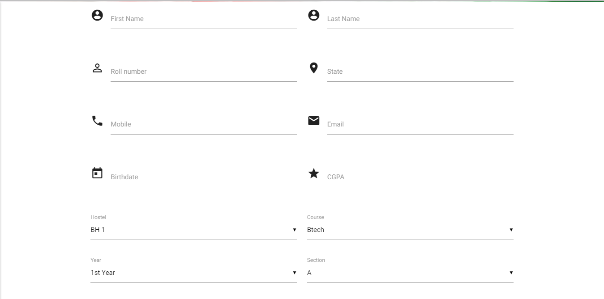
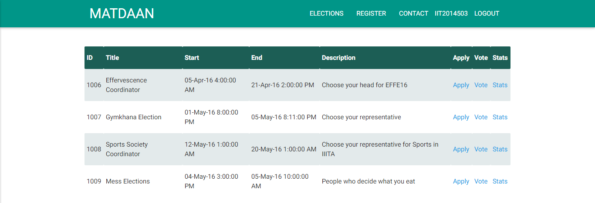
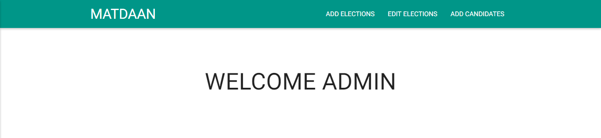
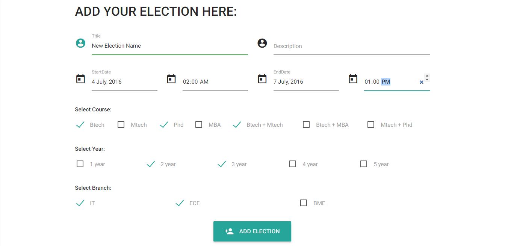

Note: Contact me for database issues.

# Online Voting System - MATDAAN

ASP.NET app for managing and conducting online elections in SRM AP. This project was made as a DBMS project in the 6th Semester.

## Table of contents

- [Installation](#installation)
    - [Prerequisites](#prerequisites)
    - [Using Microsoft Visual Studio 2015](#using-microsoft-visual-studio)
    - [Technologies Used](#technologies-used)
- [Features](#features)
    - [Users](#users)
        - [Login And Register](#login-and-register)
        - [List Elections](#list-elections)
        - [Vote!](#vote)
        - [Show Stats](#show-stats)
    - [Admin](#admin)
        - [Add Elections](#add-elections)
        - [Edit Elections](#edit-elections)
        - [Add Candidates](#add-candidates)
        - [Candidate Details](#candidate-details)
- [Contributers](#contributers)
- [Links](#links)

## Installation 

### Prerequisites 

1. Microsoft Visual Studio 2010 or later
2. Micosoft SQL Server
3. SQL Configuration Manager
4. IIS Server
5. Web Browser

### Using Microsoft Visual Studio 2015 
<pre>
1. Create a new <del>Project</del> Website in Visual Studio  
2. Fork this repo  
3. Copy all the files in this repo to website's folder  
4. Configure Database on the machine accordingly (Using voting.mdf file checked in)
5. Run the website  
</pre>

### Technologies Used 

1. <b>Materialize 0.97 (for css)</b>
2. ASP.NET framework 5
3. HTML and C#
4. SQL

## Features 

> USERS 

### Login and Register 
This app manages individual user accounts and provides facility for user to register himself to this app. It contains an <code>admin</code> section to manage all current elections and candidates.

### List Elections 
All current elections are listed in Elections tab and their details provided. User can apply as a candidate before the beginning of the election and wait for approval. During election any eligible user can vote for selected candidates.

> ADMIN 

### Admin Panel 
Go to the admin panel by <code>/admin.aspx</code>. Currently there is no security for admin panel but it will be provided in the future. There are options avaliable to Add Elections, Edit Elections and Add Candidates.

### Add Elections 
Admin can add Elections by providing the details of the election. Once successfully added, Election is shown in the Election's list to all users.

## Links 

Visit me:     [Krishna Sharma](https://www.linkedin.com/in/krishna-sharma-39b34524b/)

Contact me:     <sharmakrisha382@gmail.com>
